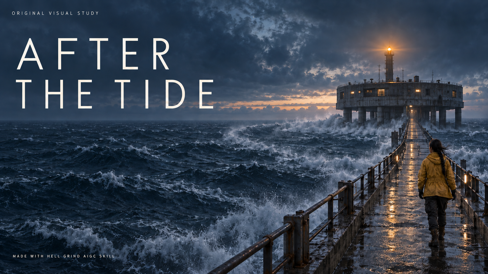
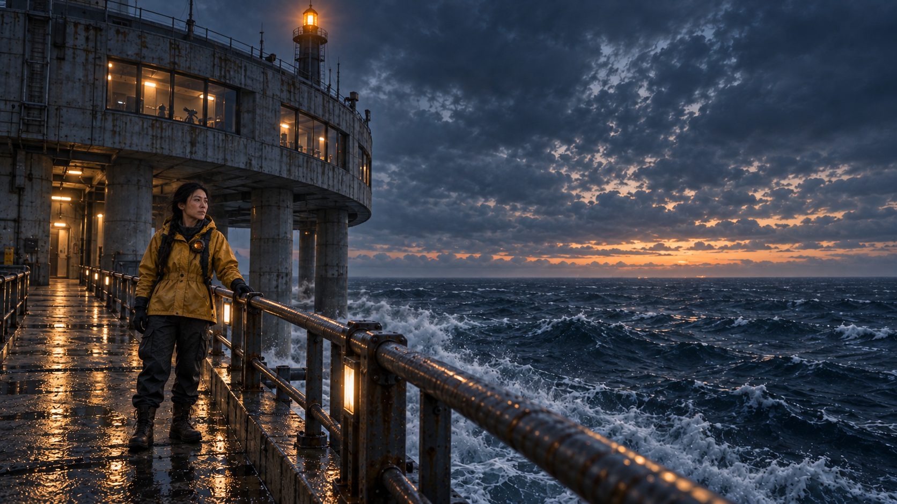
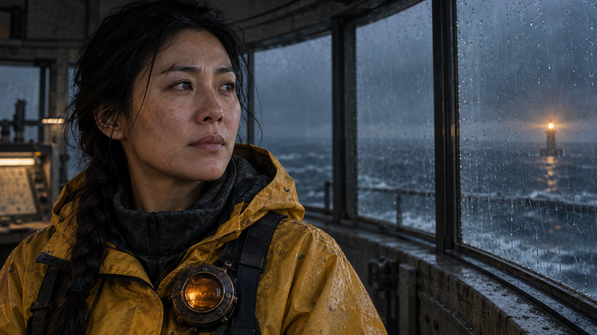

<div align="center">

# Hell Grind AIGC Skill

**Turn creative intent into actionable prompts. Connect shots into a traceable production.**

A reusable skill for AI image and video creation · Model-agnostic · From one concept image to a multi-shot story

[](CHANGELOG.md) [](LICENSE) [](https://agentskills.io/specification) [](docs/usage.md)

[简体中文](README.md) · **English**

[Quick start](#quick-start) · [Why use it](#why-use-it) · [Visual styles](#one-workflow-many-visual-styles) · [Usage guide](docs/usage.md) · [Contributing](CONTRIBUTING.md)

</div>

[](examples/after-the-tide/README.md)

*AFTER THE TIDE, an original visual study: prompts developed with this Skill and rendered with an AI image tool. Explore the [full prompts and production notes](examples/after-the-tide/README.md). This is concept artwork; no film has been produced.*

Hell Grind AIGC Skill brings **prompt crafting, production management, and failure diagnosis** into one reusable workflow. Start with an image, a video prompt, or a film brief. Add asset records, scene maps, shot contracts, generation logs, selections, and delivery checks as your project grows.

The package contains Markdown instructions, templates, and local scripts in the [Agent Skills](https://agentskills.io/specification) directory format. Compatible clients can load the complete skill folder; other assistants with file access can follow its entry point and references. See the [installation guide](docs/installation.md).

## Why use it

| Capability | What it helps you do |
| --- | --- |
| **Separate creative intent from provider settings** | Write a model-independent master prompt and keep platform parameters in a separate adapter. Retain approved decisions when changing tools. |
| **Preserve the brief** | Keep character counts, identity, duration, exact dialogue, and exclusions intact when polishing. Get a summary of what changed. |
| **Direct the whole shot** | Use seven prompt layers, 11 image information categories, and a 12-part video shot contract to connect composition, acting, camera, audio, and continuity. |
| **Track consistency explicitly** | Use 14 schema v2 tables for asset states, reference scope, shots, prompt versions, generation batches, and selection decisions. |
| **Make iteration explainable** | Diagnose six failure categories and record changed variables, hypotheses, and retests before deciding to simplify or split a shot. |
| **Use only what you need** | One skill, 22 reference documents loaded as needed, and 3 local tools with no third-party Python dependencies. A single prompt does not require a full project. |

Choose **concise**, **standard**, or **director** detail. Detail can change; hard constraints stay intact.

## Quick start

**Try one shot first.** Download or clone the repository. Ask your assistant to read `skill/hell-grind-aigc-skill/SKILL.md` and the relevant references, then send:

```text
Use Hell Grind AIGC Skill to write a standard video prompt for this original scene:
An adult watchmaker pauses at a workbench at dawn and looks toward the window.
Exactly one person, 6 seconds, one continuous take, no dialogue.
Use a warm hand-drawn animation style.
Preserve those constraints. Return the master prompt, a separate platform adapter,
and the first-test checks. The generation model is not specified yet.
```

The response includes a constraint snapshot, master prompt, platform adapter, design notes, assumptions, and review recommendations. An unknown provider stays `unspecified`.

<details>
<summary><strong>See an abbreviated example: from an idea to a shot design</strong></summary>

This original example illustrates structure. It omits the full score and commentary and has not been rendered by a generation model.

```text
Constraints: one adult watchmaker; 6 seconds; one take; no dialogue; hand-drawn animation.
Opening: watchmaker at frame-left, workbench below, window at frame-right.
Beats: 0–2s set down the tweezers; 2–4s turn gaze toward the window;
       4–6s hold the profile and exhale gently.
Camera: slow straight push from a chest-height medium shot to a profile close-up
        that retains the edge of the window frame.
Look: clean drawn contours, paper grain, warm cream and soft teal;
      preserve the character silhouette across frames.
Sound: ticking clocks and a soft fabric rustle; no dialogue or music.
Must hold: one character, one pair of tweezers, window direction, clothing colors.
Platform adapter: unspecified.
```

</details>

For automatic skill discovery, copy the entire `skill/hell-grind-aigc-skill/` folder into your client's supported skills directory. The [installation guide](docs/installation.md) covers generic setup, Claude Code, and Codex. Keep the references, scripts, and templates with the entry point.

## Original showcase: AFTER THE TIDE

**After a storm, a lone engineer restores an offshore weather station's beacon and waits for a distant reply.** Starting with this independent brief, we used the Skill to define character, wardrobe, props, space, and lighting before generating a poster and two concept stills.

<table>
  <tr>
    <td width="50%"><a href="examples/after-the-tide/README.md"></a></td>
    <td width="50%"><a href="examples/after-the-tide/README.md"></a></td>
  </tr>
  <tr>
    <td><strong>Space and environment</strong><br>Establish scale and spatial relationships through the figure, causeway, sea, and station.</td>
    <td><strong>Performance and texture</strong><br>Specify eyelines, restrained expression, wet fabric, and motivated warm and cool light.</td>
  </tr>
</table>

*All three images were made from newly written prompts. Image references were limited to artwork generated for this case; no Hell Grind poster, still, character, or source prompt was used. The production notes record a prop-placement correction and remaining detail differences between images.*

**[Explore the brief, reference scopes, exact prompts, and review →](examples/after-the-tide/README.md)**

## One workflow, many visual styles

The workflow separates identity, space, action, and continuity from the visual treatment you choose. The showcase uses cinematic realism; the table below describes adaptable dimensions, not completed tests of every style or model.

| Visual direction | Adapt | Preserve |
| --- | --- | --- |
| Live-action realism / documentary feel | Restrained performance, motivated light, material texture, camera behavior | Identity, eyelines, space, action handoffs |
| Science fiction / fantasy | World rules, scale anchors, materials, effects and their timing | Counts, positions, contact, state changes |
| 2D animation / comics | Contours, color blocks, pose timing, exaggeration | Character readability, prop ownership, action causality |
| Watercolor / picture books | Paper texture, edges, pigment diffusion, negative space | Subject count, visual focus, narrative order |
| Product advertising / still life | Geometry, surfaces, brand palette, presentation angle | Exact text, proportions, product interaction |

Explore [one original scene in multiple styles](docs/style-adaptability.md), with the same story and shot constraints.

## Grow from a shot to a production

```text
Brief → Assets & states → Scenes & space → Shots & prompts
                                               ↓
Delivery ← Edit & continuity ← Review & selection ← Generation log
                                               ↕
                                      Diagnose → Revise → Retest
```

The local tools require Python 3.10+. Run them from the repository root:

```bash
python3 skill/hell-grind-aigc-skill/scripts/init_project.py \
  --name "My AIGC Film" --output ./my-aigc-film

python3 skill/hell-grind-aigc-skill/scripts/validate_project.py \
  ./my-aigc-film --strict-v2 --json

python3 skill/hell-grind-aigc-skill/scripts/audit_prompt.py \
  examples/watchmaker-video.md --medium video --json
```

The last command audits the included [original prompt example](examples/watchmaker-video.md); replace its path with your own prompt when working on a shot. Initialization refuses a non-empty destination. Both checkers are read-only. These three local operations make **zero network requests and zero database operations**. Media generation happens separately in the tool you choose.

A passing project check confirms record integrity. A prompt score reflects structural checks and explicit conflicts. Visual quality and delivery readiness still require generation, viewing, and review. See the [usage guide](docs/usage.md) for v1 compatibility and more commands.

## Documentation

| Goal | Read |
| --- | --- |
| Install or connect your assistant | [Installation](docs/installation.md) |
| Write, polish, diagnose, or audit | [Usage guide](docs/usage.md) |
| Inspect generated artwork and its full prompts | [AFTER THE TIDE production notes](examples/after-the-tide/README.md) |
| Adapt a creative idea to another visual style | [Style examples](docs/style-adaptability.md) |
| Understand the skill entry point | [SKILL.md](skill/hell-grind-aigc-skill/SKILL.md) |
| Explore production structure | [Prompt architecture](skill/hell-grind-aigc-skill/references/prompt-architecture.md) · [Project schemas](skill/hell-grind-aigc-skill/references/project-schemas.md) |
| Review methodology and evidence limits | [Research notes](skill/hell-grind-aigc-skill/references/methodology-evidence.md) · [Source credits](NOTICE.md) |
| Follow changes or contribute | [Changelog](CHANGELOG.md) · [Contributing](CONTRIBUTING.md) |

The entry point uses English with Chinese workflow labels. Detailed production references are primarily in Chinese. Request your preferred output language from your assistant; translations of the reference library are welcome.

## Source and credits

This independent community project takes inspiration from Higgsfield Studio's publicly shared **Hell Grind** production practice. Its workflows, templates, tools, and examples are independently written, drawing on general filmmaking, asset management, and quality control principles. The source project informs the method; our creative examples use independent characters, stories, and visual settings.

**[Explore the official Hell Grind film, open project, and production brief →](https://higgsfield.ai/@higgsfield.studio/projects/hell-grind)**

We are not affiliated with Higgsfield Studio. Current documentation displays our original AI concept artwork. Source-project materials remain subject to the [upstream license](https://higgsfield.ai/licences/owl-p-nl-1.0), not this repository's MIT license. See [NOTICE](NOTICE.md).

## Contributing

Reproducible failure cases, original prompt examples, client setup notes, translations, and documentation improvements are welcome. Read [CONTRIBUTING](CONTRIBUTING.md), then [open an issue](https://github.com/renmu2017/Hell-Grind-AIGC-Skill/issues) or submit a pull request.

If the workflow helps your work, consider starring the repository or sharing it with another creator.

## License

Original code, documentation, templates, and examples are available under the [MIT License](LICENSE), to the extent the maintainers hold the relevant rights. Retain the copyright and permission notice when copying or distributing. See [NOTICE](NOTICE.md) for generated-image provenance and third-party names.
